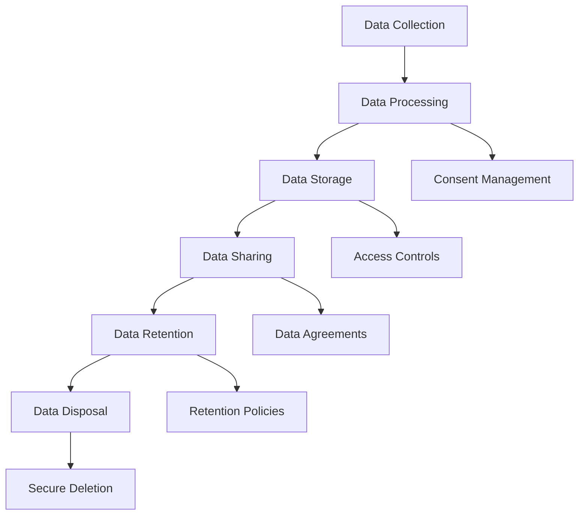

# GDPR Compliance Implementation Guide

**Document Version:** 1.0  
**Last Updated:** [Date]  
**Target Audience:** Development Team, System Administrators, Data Protection Officer

## 1. Overview

This guide provides technical implementation details for GDPR compliance in the GSOS School Management System. It covers data protection by design and by default principles.

## 2. Data Protection by Design and Default

### 2.1 Privacy by Design Principles

1. **Proactive not Reactive**
   - Implement privacy controls before data processing begins
   - Anticipate and prevent privacy invasions

2. **Privacy as the Default Setting**
   - Maximum privacy protection without requiring action from the data subject
   - Default settings should be privacy-friendly

3. **Full Functionality**
   - Accommodate all legitimate interests without unnecessary trade-offs
   - Positive-sum approach

4. **End-to-End Security**
   - Secure data throughout its lifecycle
   - Encryption, access controls, and secure disposal

5. **Visibility and Transparency**
   - Ensure all stakeholders can verify privacy practices
   - Clear documentation and audit trails

6. **Respect for User Privacy**
   - Keep user interests paramount
   - User-centric design

### 2.2 Technical Implementation

```typescript
// Example: Privacy-first data collection
interface StudentDataCollection {
  // Only collect necessary data
  requiredFields: string[];
  optionalFields: string[];
  
  // Implement consent management
  consentStatus: ConsentRecord;
  
  // Data minimization
  retentionPeriod: number;
  
  // Purpose limitation
  processingPurposes: ProcessingPurpose[];
}
```

## 3. Data Mapping and Classification

### 3.1 Data Inventory

| Data Type | Category | Legal Basis | Retention | Special Category |
|-----------|----------|-------------|-----------|------------------|
| Student Records | Personal | Legal Obligation | 7 years | No |
| Health Records | Special | Vital Interests | 25 years | Yes |
| Safeguarding | Special | Legal Obligation | 25 years | Yes |
| Financial | Personal | Contract | 6 years | No |
| System Logs | Personal | Legitimate Interest | 90 days | No |

### 3.2 Data Flow Mapping



## 4. Technical Safeguards Implementation

### 4.1 Encryption Requirements

```typescript
// Data at rest encryption
const encryptionConfig = {
  algorithm: 'AES-256-GCM',
  keyManagement: 'AWS KMS',
  keyRotation: '90 days',
  backupEncryption: true
};

// Data in transit encryption
const tlsConfig = {
  minVersion: 'TLSv1.2',
  cipherSuites: ['ECDHE-RSA-AES256-GCM-SHA384'],
  certificateValidation: true,
  hsts: true
};
```

### 4.2 Access Control Implementation

```typescript
// Role-based access control
interface AccessControl {
  userId: string;
  role: UserRole;
  permissions: Permission[];
  dataAccess: DataAccessLevel;
  temporaryAccess?: TemporaryAccess;
}

// Audit logging for access
function logDataAccess(
  operation: 'read' | 'write' | 'delete',
  dataType: string,
  userId: string,
  success: boolean,
  metadata?: Record<string, any>
): void {
  // Implementation in secure-logging.ts
}
```

### 4.3 Data Anonymization

```typescript
// Anonymization utilities
const anonymizationRules = {
  studentId: (id: string) => `ANON_${hashFunction(id)}`,
  name: () => '[REDACTED]',
  email: () => '[REDACTED]',
  dateOfBirth: (dob: string) => {
    const year = new Date(dob).getFullYear();
    return `${year}-XX-XX`;
  }
};

function anonymizeRecord(
  record: any,
  rules: Record<string, Function>
): any {
  // Implementation in data-retention.ts
}
```

## 5. Data Subject Rights Implementation

### 5.1 Right of Access (Article 15)

```typescript
interface DataAccessRequest {
  subjectId: string;
  requestDate: Date;
  dataTypes: string[];
  format: 'JSON' | 'PDF' | 'CSV';
}

async function processAccessRequest(
  request: DataAccessRequest
): Promise<DataExport> {
  // 1. Verify identity
  // 2. Collect all personal data
  // 3. Apply necessary redactions
  // 4. Generate export
  // 5. Log the request
}
```

### 5.2 Right to Rectification (Article 16)

```typescript
interface RectificationRequest {
  subjectId: string;
  dataType: string;
  currentValue: any;
  correctedValue: any;
  justification: string;
}

async function processRectification(
  request: RectificationRequest
): Promise<void> {
  // 1. Validate correction
  // 2. Update data
  // 3. Notify relevant parties
  // 4. Log the change
}
```

### 5.3 Right to Erasure (Article 17)

```typescript
interface ErasureRequest {
  subjectId: string;
  dataTypes: string[];
  reason: ErasureReason;
  exceptions?: string[];
}

enum ErasureReason {
  NO_LONGER_NECESSARY = 'no_longer_necessary',
  CONSENT_WITHDRAWN = 'consent_withdrawn',
  UNLAWFUL_PROCESSING = 'unlawful_processing',
  LEGAL_OBLIGATION = 'legal_obligation'
}

async function processErasure(
  request: ErasureRequest
): Promise<ErasureResult> {
  // 1. Check legal obligations
  // 2. Identify data to delete
  // 3. Perform secure deletion
  // 4. Update related records
  // 5. Notify third parties
}
```

## 6. Consent Management

### 6.1 Consent Record Structure

```typescript
interface ConsentRecord {
  subjectId: string;
  purpose: string;
  consentGiven: boolean;
  consentDate: Date;
  consentMethod: 'explicit' | 'opt_in' | 'implied';
  withdrawalDate?: Date;
  legalBasis: string;
  version: string;
}

class ConsentManager {
  async recordConsent(consent: ConsentRecord): Promise<void> {
    // Store consent with audit trail
  }
  
  async withdrawConsent(
    subjectId: string, 
    purpose: string
  ): Promise<void> {
    // Process consent withdrawal
  }
  
  async checkConsent(
    subjectId: string, 
    purpose: string
  ): Promise<boolean> {
    // Verify current consent status
  }
}
```

### 6.2 Consent UI Components

```typescript
// React component for consent management
interface ConsentFormProps {
  purposes: ConsentPurpose[];
  onConsentChange: (consents: ConsentRecord[]) => void;
  currentConsents?: ConsentRecord[];
}

const ConsentForm: React.FC<ConsentFormProps> = ({
  purposes,
  onConsentChange,
  currentConsents
}) => {
  // Implement granular consent controls
  // Clear language and explanations
  // Easy withdrawal mechanism
};
```

## 7. Data Breach Response

### 7.1 Breach Detection

```typescript
interface SecurityEvent {
  eventId: string;
  timestamp: Date;
  eventType: 'unauthorized_access' | 'data_leak' | 'system_compromise';
  severity: 'low' | 'medium' | 'high' | 'critical';
  affectedData: string[];
  affectedSubjects: number;
  containmentStatus: 'ongoing' | 'contained' | 'resolved';
}

class BreachDetector {
  async detectBreach(event: SecurityEvent): Promise<void> {
    if (this.isPersonalDataBreach(event)) {
      await this.initiateBreachResponse(event);
    }
  }
  
  private async initiateBreachResponse(
    event: SecurityEvent
  ): Promise<void> {
    // 1. Assess severity
    // 2. Contain the breach
    // 3. Assess risk to individuals
    // 4. Notify authorities if required
    // 5. Notify affected individuals if required
  }
}
```

### 7.2 Breach Notification

```typescript
interface BreachNotification {
  breachId: string;
  notificationType: 'authority' | 'individual';
  recipient: string;
  notificationDate: Date;
  content: string;
  deliveryMethod: 'email' | 'post' | 'phone';
  acknowledged: boolean;
}

async function notifyDataBreach(
  breach: SecurityEvent,
  recipients: string[]
): Promise<void> {
  // Implement 72-hour notification to ICO
  // Individual notification if high risk
  // Clear, plain language communication
}
```

## 8. Privacy Impact Assessments (PIAs)

### 8.1 PIA Triggers

Conduct a PIA when:
- New data processing activities
- Significant changes to existing processing
- High risk to individual rights
- New technologies or systems
- Large-scale processing of special category data

### 8.2 PIA Process

```typescript
interface PrivacyImpactAssessment {
  id: string;
  title: string;
  description: string;
  dataTypes: string[];
  processingPurposes: string[];
  legalBasis: string[];
  riskAssessment: RiskAssessment;
  mitigationMeasures: MitigationMeasure[];
  consultationRequired: boolean;
  approvalStatus: 'pending' | 'approved' | 'rejected';
  reviewDate: Date;
}

interface RiskAssessment {
  likelihood: 'low' | 'medium' | 'high';
  impact: 'low' | 'medium' | 'high';
  overallRisk: 'low' | 'medium' | 'high';
  riskDescription: string;
}
```

## 9. Data Protection Officer (DPO) Requirements

### 9.1 DPO Responsibilities

- Monitor GDPR compliance
- Conduct privacy impact assessments
- Serve as contact point for data subjects
- Cooperate with supervisory authorities
- Provide data protection training

### 9.2 DPO Support Tools

```typescript
interface DPODashboard {
  activeRequests: DataSubjectRequest[];
  breachAlerts: SecurityEvent[];
  complianceMetrics: ComplianceMetric[];
  upcomingReviews: ReviewTask[];
  trainingStatus: TrainingRecord[];
}

class DPOTools {
  async generateComplianceReport(): Promise<ComplianceReport> {
    // Generate comprehensive compliance status
  }
  
  async scheduleDataAudit(): Promise<AuditSchedule> {
    // Schedule regular data audits
  }
  
  async trackDataSubjectRequests(): Promise<RequestStatus[]> {
    // Monitor request processing times
  }
}
```

## 10. Training and Awareness

### 10.1 Staff Training Requirements

- GDPR principles and requirements
- Data handling procedures
- Security best practices
- Incident reporting
- Data subject rights

### 10.2 Training Tracking

```typescript
interface TrainingRecord {
  staffId: string;
  trainingModule: string;
  completionDate: Date;
  score?: number;
  certificateIssued: boolean;
  renewalDate: Date;
}

class TrainingManager {
  async trackTrainingCompletion(
    record: TrainingRecord
  ): Promise<void> {
    // Record training completion
    // Schedule renewal reminders
  }
  
  async generateTrainingReport(): Promise<TrainingReport> {
    // Compliance training status
  }
}
```

## 11. Vendor Management

### 11.1 Data Processing Agreements

```typescript
interface DataProcessingAgreement {
  vendorId: string;
  agreementDate: Date;
  dataTypes: string[];
  processingPurposes: string[];
  securityMeasures: string[];
  subProcessors: string[];
  dataLocation: string;
  retentionPeriod: number;
  auditRights: boolean;
}
```

### 11.2 Vendor Assessment

- Security certifications (ISO 27001, SOC 2)
- GDPR compliance documentation
- Data processing agreements
- Regular security assessments
- Incident response procedures

## 12. Monitoring and Auditing

### 12.1 Compliance Monitoring

```typescript
interface ComplianceMetric {
  metric: string;
  value: number;
  target: number;
  status: 'compliant' | 'at_risk' | 'non_compliant';
  lastUpdated: Date;
}

const complianceMetrics = [
  'data_subject_request_response_time',
  'security_incident_response_time',
  'staff_training_completion_rate',
  'data_retention_compliance_rate',
  'consent_withdrawal_processing_time'
];
```

### 12.2 Audit Procedures

- Regular internal audits
- External compliance assessments
- Penetration testing
- Data flow reviews
- Policy effectiveness reviews

## 13. Documentation Requirements

### 13.1 Records of Processing Activities

```typescript
interface ProcessingRecord {
  id: string;
  controllerName: string;
  purposes: string[];
  dataSubjectCategories: string[];
  personalDataCategories: string[];
  recipients: string[];
  thirdCountryTransfers: string[];
  retentionPeriods: string[];
  securityMeasures: string[];
}
```

### 13.2 Documentation Maintenance

- Keep records up to date
- Regular review and updates
- Version control
- Access controls
- Backup and recovery

## 14. Implementation Checklist

### 14.1 Technical Implementation

- [ ] Encryption at rest and in transit
- [ ] Access controls and authentication
- [ ] Audit logging and monitoring
- [ ] Data anonymization capabilities
- [ ] Secure data deletion
- [ ] Consent management system
- [ ] Data subject request handling
- [ ] Breach detection and response
- [ ] Privacy impact assessment tools

### 14.2 Organizational Implementation

- [ ] Privacy policy published
- [ ] Data protection officer appointed
- [ ] Staff training program
- [ ] Data processing agreements
- [ ] Incident response procedures
- [ ] Regular compliance audits
- [ ] Documentation maintenance
- [ ] Vendor management program

## 15. Continuous Improvement

### 15.1 Regular Reviews

- Annual policy reviews
- Quarterly compliance assessments
- Monthly security reviews
- Ongoing staff training
- Technology updates

### 15.2 Feedback and Updates

- Monitor regulatory changes
- Industry best practices
- Stakeholder feedback
- Incident lessons learned
- Technology improvements

---

**Document Control:**
- **Owner:** Data Protection Officer
- **Contributors:** Development Team, Security Team
- **Review Frequency:** Quarterly
- **Next Review:** [Date]
- **Version Control:** Git repository